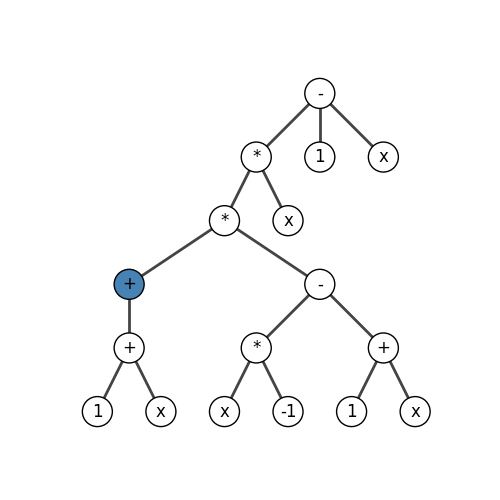

# Genetic Programming

## Abstract

Implementation of genetic programming principles applied to curve fitting.

## How it works

The algorithm iterates over a population of function trees. These trees are a representation of the function, where each node represents either:

- a parameter
- an operator
- a constant

Here is what a tree looks like, the blue node is the root: 

  

It represents the function: $$ f(x) = x^3 + x $$

## Credits

First produced as a project at ENAC in collaboration with _Nolan Djama_, _Hilal Aït-Slimani_ and _Sebastian Vasquez-Cruz_, then iterated upon personally.
