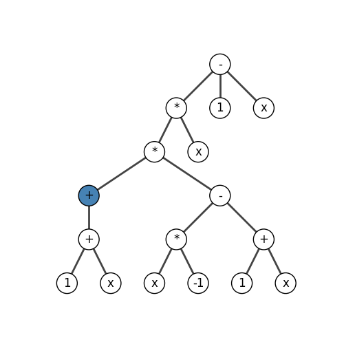
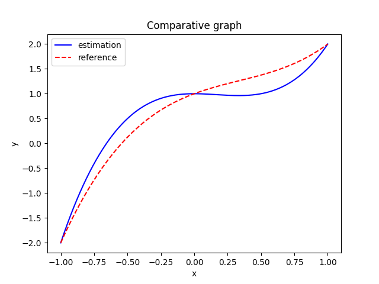
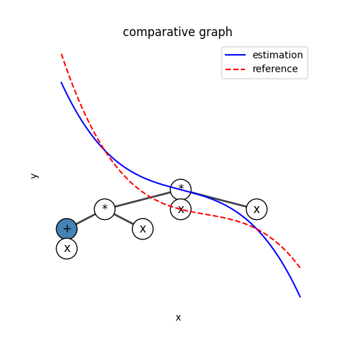
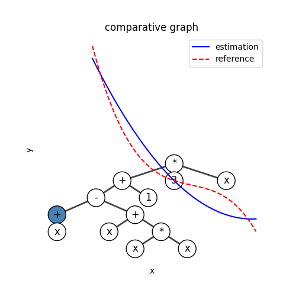
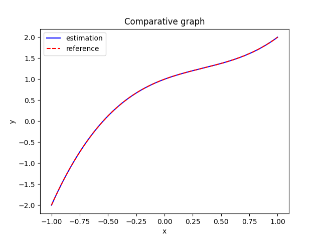
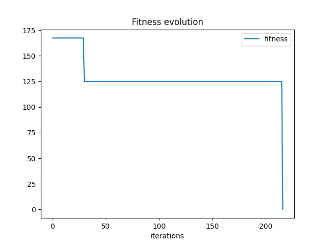

# Genetic Programming

## Abstract

Implementation of genetic programming principles applied to curve fitting.

## How it works

The algorithm iterates over a population of function trees. These trees are a representation of the function, where each node represents:

- an operator

and each leaf represents either:

- a parameter
- a constant

Here is what a tree looks like, the blue node being the root: 

<p align="center">
  
</p>

It represents the function: 

$$ f(x) = x^3 + x $$

Each iteration produces a new population which which is compared to the reference `Y_ref` with the `fitness` function. 

The population is then evolved from the best tree of the population. The evolution has two modes:

- fusion: two function trees are fused at a random node,
- mutation: a function tree is changed randomly at a random node. 

The algorithm stops when the best solution reaches the accuracy threshold or when `max_it` is reached.

<table>
  <tr>
    <td align="center" width="50%">
      
      <br/>
      <sub><b>Iteration 125</b></sub>
    </td>
    <td align="center" width="50%">
      
      <br/>
      <sub><b>Iteration 250</b></sub>
    </td>
  </tr>
  <tr>
    <td align="center" width="50%">
      
      <br/>
      <sub><b>Iteration 375</b></sub>
    </td>
    <td align="center" width="50%">
      
      <br/>
      <sub><b>Last iteration</b></sub>
    </td>
  </tr>
</table>


### Fitness definition

The fitness is the sum of absolute errors over the sampled domain:

$$
\text{fitness(tree)} = \sum |Y_{\text{ref}} - Y_{\text{tree}}|
$$

<p align="center">
  
</p>

## Installation

```bash
git clone https://github.com/GuillaumeCldn/Genetic-Programming.git
cd Genetic-Programming
python -m venv .venv
source .venv/bin/activate  # (Windows: .venv\Scripts\activate)
pip install -r requirements.txt
```

## Run

The entrypoint is `genetic.py`:

```bash
python genetic.py
```

## Repository structure

- `genetic.py` — main loop: population generation, selection, crossover (“fuse”), mutation, tracking fitness and plotting results.
- `evolve.py` — genetic operators:
  - `fuse()` (crossover): replace a subtree of parent A by a subtree of parent B (with depth constraints).
  - `mutate()`: generate a random subtree and fuse it into the individual.
- `objects.py` — data model for `Node` and `Tree` (tree creation, subtree traversal, housekeeping like trimming empty levels).
- `graphing.py` — visualization:
  - draw an individual **tree** (structure) using `igraph`
  - draw the **predicted curve vs reference curve** using `matplotlib`
- `data.py` — experiment configuration (operators, constants range, dataset, GA parameters).
- `operation.py` — operator/protected-function utilities (used to define operators safely).
- `requirements.txt` — Python dependencies.

## Configuration

All main parameters live in `data.py`, including:

- `family_size`: population size (default: 15)
- `accuracy`: target fitness threshold (default: 1e-4)
- `depth_init`: initial tree depth (default: 2)
- `max_depth`: maximum allowed tree depth (default: 4)
- `max_it`: maximum iterations (default: 500)
- `mutate_rate`: fraction of population mutated each generation (default: 0.5)
- `fuse_rate`: fraction of population generated by crossover (default: 0.25)
- `drawing_display_rate`: how many times to draw intermediate solutions (default: 4)
- `iteration_display_rate`: print progress every N iterations (default: 25)

You can also edit:
- the operator set in `func_list`
- the constant range with `constants()`
- the domain `X` and the target `Y_ref`

## Outputs / Results

Running `python genetic.py` produces interactive plots (no files are saved by default):

1. **Evolved expression tree** (structure plot)
2. **Curve comparison**: best individual (blue) vs reference function (red dashed)
3. **Fitness history**: fitness value across iterations (lower is better)

During training, the script can also print progress:
- `iteration = <it>` every `iteration_display_rate`
- a message if the maximum number of iterations is reached


## Credits

First produced as a project at ENAC in collaboration with _Nolan Djama_, _Hilal Aït-Slimani_ and _Sebastian Vasquez-Cruz_, then iterated upon personally.
